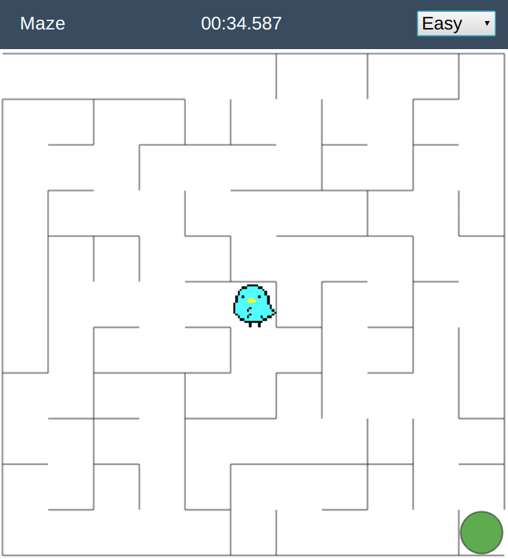
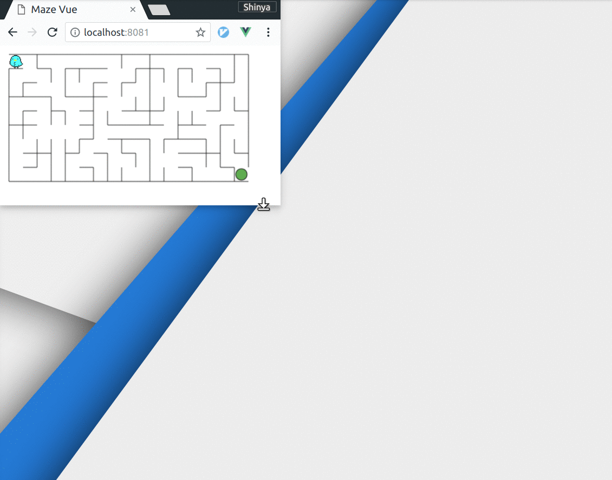
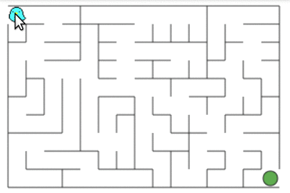
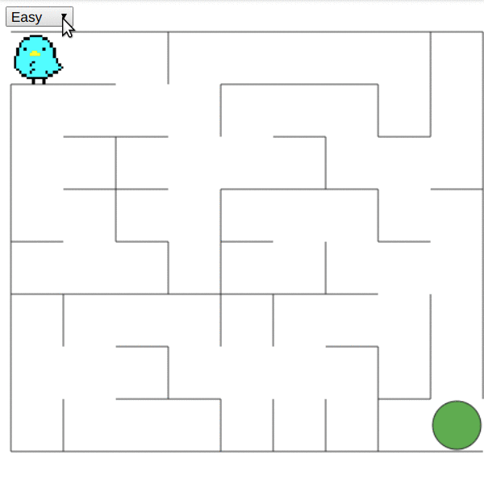

Vue-maze
===

An itty-bitty maze game made as Vue.js component

[PLAY DEMO](https://meganetaaan.github.io/maze/)



* Fit to the component size automatically



* Mousemove/Touchmove/ArrowKey to move the player



* Choose difficulty




## Install

```bash
$ npm install maze vue-maze --save
```

```JavaScript
import Vue from 'vue'
import Maze from 'vue-maze'

let v = new Vue({
  el: '#app',
  template: `
    <app>
        <maze></maze>
    </app>`,
  components: {
    Maze
  }
})

```

## Props

Props      | Type   | Description                  | Default
-----------|--------|------------------------------|--------
difficulty | string | difficulty(easy/normal/hard) | normal

## Events

Event    | Payload | Description
---------|---------|------------------------------------
init     | none    | the maze is initialized
start    | none    | the player starts to move
finish   | none    | the player has arrived at the goal
